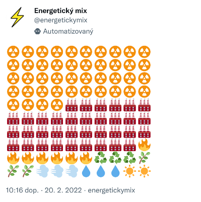

# Energetický mix

Twitter bot [@energymixcz](https://twitter.com/energymixcz) tvítující energetický mix elektřiny vyrobené v Česku za předešlou hodinu z dat [Entsoe](https://transparency.entsoe.eu/).

Za každé procento podílu na výrobě jeden emoji. 

🏭 uhlí

🔥 zemní plyn

🛢️ ropa

☢️ jádro

☀️ slunce

💨 vítr

💧 voda

🌿 biomasa

🗑️ odpad

♻️ ostatní OZE

Překvapivě neexistuje emoji pro uhlí...

TODO: Ověřit, zda ostatní OZE je výhradně bioplyn a nejspíš změnit emoji.

## Použití

Předpokladem jsou údaje potřebné pro dotazy na Entsoe a Twitter API uložené v souboru `.env` v kořenovém adresáři.

Beží jako cronjob 07 6-18 * * *
